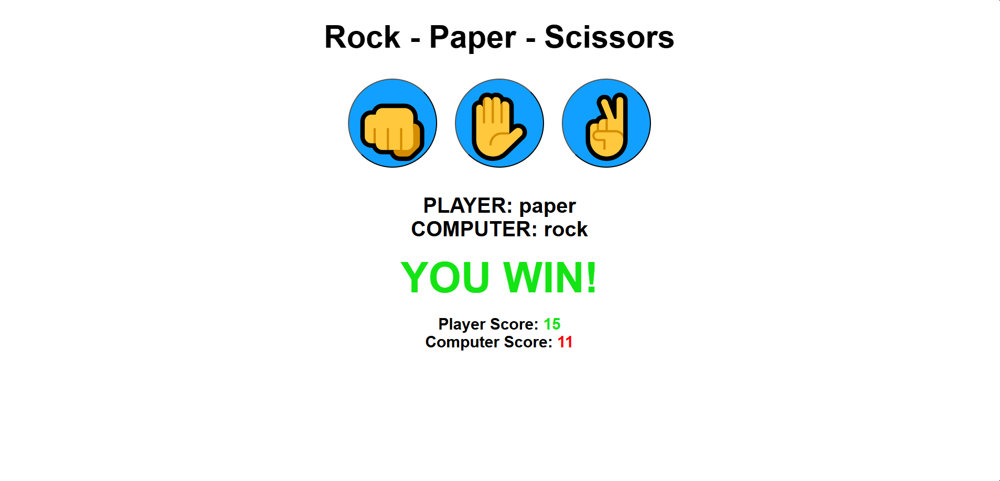

# Rock Paper Scissors 🧱 📄 ✂️

A classic Rock Paper Scissors game where players compete against the computer. The game displays player selections, round results, and keeps track of the score.

## Features ✨

- **Select winning target** - Choose the score needed to win: input your own, generate randomly, or play infinitely
- **Play against computer** - Random computer choices for each round
- **Visual feedback** - See both player and computer selections
- **Score tracking** - Real-time score updates for player and computer
- **Modal view** - Select winning target at start and view final results in a modal popup

## Key Concepts Used 🧩

- DOM selection `document.getElementById()`
- Event Handling `.addEventListener()`
- Event Delegation `e.target`
- Conditional logic `if/else`
- Switch Statement `switch()`
- Ternary Operator `condition ? value1 : value2`
- Read / Update Properties`.style` `.textContent` `.checked`

## Programming Languages Used 🛠️

- HTML
- CSS
- JavaScript

## Screenshot 📸

## Future Enhancements 🚀

- Add animation effects for results
- Add popup on invalid winning target input
- Add game history